# API Tester CLI - End-to-End Architecture

## Overview

API Tester CLI is a command-line tool that automatically tests OpenAPI/Swagger APIs by parsing schema files, generating test data, executing HTTP requests, validating responses, and generating reports.

### Implementation Status

**Phase 0: Foundation & Storage Enhancement** ✅ **COMPLETED**
- ✅ Database schema extensions (v2 migration)
- ✅ AI storage namespaces (4 new namespaces: ai_tests, validation_feedback, ai_prompts, patterns)
- ✅ Test case library directory structure (`~/.apitest/validated_tests/`)
- ✅ All namespace classes implemented (AITestsNamespace, ValidationFeedbackNamespace, AIPromptsNamespace, PatternsNamespace)
- ✅ Storage class updated with all new namespaces
- **Tests**: 24/24 passing

**Phase 1: Configuration & Routing** ✅ **COMPLETED**
- ✅ Step 1.1: AI Configuration in ConfigManager (12/12 tests passing)
  - AIConfig dataclass implemented
  - Profile parsing with AI config support
  - Environment variable support for API keys
  - Validation for provider, mode, temperature, max_tokens
- ✅ Step 1.2: CLI Flags for AI Mode
  - `--mode` flag (schema/ai/hybrid)
  - `--ai-provider` flag (groq/openai/anthropic)
  - `--ai-model` flag
  - `--ai-temperature` flag
  - `--ai-max-tokens` flag
  - `--ai-enabled` flag
  - CLI flag parsing and validation implemented
  - Priority: CLI > Profile > Default
- ✅ Step 1.3: Test Generator Router
  - Router pattern implemented in `TestGenerator` class
  - `_generate_schema_tests()` method (existing functionality)
  - `_generate_ai_tests()` method (fully implemented, calls AITestGenerator)
  - `_combine_tests()` method for hybrid mode with deduplication
  - TestCase dataclass with `is_ai_generated` and `ai_metadata` fields
  - Router tests implemented and passing

**Phase 2: AI Core Components** ✅ **COMPLETED**
- ✅ Step 2.1: Groq API Client (12/12 tests passing)
  - `GroqClient` class with error handling and retry logic
  - Custom exceptions: `GroqAPIError`, `GroqRateLimitError`, `GroqAuthenticationError`
  - Token usage tracking
  - Exponential backoff for rate limits and server errors
  - `groq>=0.4.0` added to requirements.txt
- ✅ Step 2.2: Context Builder (14/14 tests passing)
  - `ContextBuilder` class for aggregating context from multiple sources
  - Extracts endpoint info from OpenAPI schema
  - Retrieves historical test results, validated examples, and learned patterns
  - 5-minute caching to reduce storage queries
- ✅ Step 2.3: Prompt Builder (25/25 tests passing)
  - `PromptBuilder` class with template management
  - Multiple prompt templates (basic, advanced, edge-cases)
  - Multiple schema formats (JSON, YAML, TOON)
  - Multiple prompt formats (Markdown, XML)
  - Default prompt initialization
- ✅ Step 2.4: Response Parser (21/21 tests passing)
  - `ResponseParser` class with multiple format support
  - Parses JSON arrays, single objects, markdown code blocks
  - Validates test case structure
  - Handles malformed responses gracefully
- ✅ Step 2.5: AI Test Generator (14/14 tests passing)
  - `AITestGenerator` class integrating all components
  - End-to-end test generation pipeline
  - Error handling and fallback logic
  - Test case creation with AI metadata

**Phase 3: AI Execution & Integration** ✅ **COMPLETED**
- ✅ Step 3.1: Test Case Data Structure
  - TestResult dataclass extended with `is_ai_generated`, `ai_metadata`, `test_scenario`, `test_case_id` fields
  - APITester handles AI test cases
- ✅ Step 3.2: Result Routing
  - Results separated into AI and schema results
  - Different storage paths for each type
- ✅ Step 3.3: AI Test Storage
  - AI tests saved to `Storage.ai_tests` with `validation_status='pending'`
  - Test case IDs linked to results
- ✅ Step 3.4: Hybrid Mode Integration
  - TestGenerator router fully integrated into tester.py
  - CLI creates TestGenerator instance when AI mode enabled
  - Hybrid mode combines schema and AI tests
- ✅ Step 3.5: Error Handling & Fallback
  - Error handling in `_generate_ai_tests()` with graceful fallback
  - Hybrid mode falls back to schema tests if AI fails

**Phase 4: Validation & Feedback** ✅ **COMPLETED**
- ✅ Step 4.1: Validation Data Model
- ✅ Step 4.2: CLI Validation Interface
- ✅ Step 4.3: JSON Validation Interface
- ✅ Step 4.4: Feedback Storage
- ✅ Step 4.5: Integration with Test Execution

**Phase 5: Learning Loop** ✅ **MOSTLY COMPLETED** (5/6 steps)
- ✅ Step 5.1: Feedback Analyzer
- ✅ Step 5.2: Pattern Extractor Enhancement
- ✅ Step 5.3: Prompt Refiner
- ⏳ Step 5.4: MCP Server Integration (Optional - not started)
- ✅ Step 5.5: Learning Loop Orchestration
- ✅ Step 5.6: Test Case Library Management

**Phase 6: Polish & Documentation** ⏳ **NOT STARTED**
- ⏳ Step 6.1: Error Handling & Edge Cases
- ⏳ Step 6.2: Performance Optimization
- ⏳ Step 6.3: Documentation
- ⏳ Step 6.4: Testing & Quality Assurance
- ⏳ Step 6.5: Release Preparation

## High-Level Flow

```
┌─────────────────────────────────────────────────────────────────┐
│                         USER INPUT                               │
│  apitest schema.yaml --auth bearer=$TOKEN --profile production  │
└────────────────────────────┬────────────────────────────────────┘
                             │
                             ▼
┌─────────────────────────────────────────────────────────────────┐
│                    CONFIGURATION LAYER                           │
│  ┌──────────────┐  ┌──────────────┐  ┌──────────────┐         │
│  │ Config Mgr   │→ │ Load Profile │→ │ Merge Config │         │
│  └──────────────┘  └──────────────┘  └──────────────┘         │
└────────────────────────────┬────────────────────────────────────┘
                             │
                             ▼
┌─────────────────────────────────────────────────────────────────┐
│                    SCHEMA PROCESSING                             │
│  ┌──────────────┐  ┌──────────────┐  ┌──────────────┐         │
│  │ Parse Schema │→ │  Validate    │→ │ Extract Info │         │
│  └──────────────┘  └──────────────┘  └──────────────┘         │
└────────────────────────────┬────────────────────────────────────┘
                             │
                             ▼
┌─────────────────────────────────────────────────────────────────┐
│                    AUTHENTICATION                                │
│  ┌──────────────┐  ┌──────────────┐  ┌──────────────┐         │
│  │ Auth Handler │→ │ Token Store  │→ │ System       │         │
│  │              │  │ (Keyring)    │  │ Keyring      │         │
│  └──────────────┘  └──────────────┘  └──────────────┘         │
└────────────────────────────┬────────────────────────────────────┘
                             │
                             ▼
┌─────────────────────────────────────────────────────────────────┐
│                    TEST EXECUTION                                │
│  For Each Endpoint:                                              │
│  ┌──────────────┐  ┌──────────────┐  ┌──────────────┐         │
│  │ Generate     │→ │ Build URL    │→ │ Execute      │         │
│  │ Test Data    │  │ + Auth       │  │ HTTP Request │         │
│  └──────────────┘  └──────────────┘  └──────────────┘         │
│         ▲                  │                    │               │
│         │                  │                    ▼               │
│         │                  │         ┌──────────────────┐      │
│         │                  │         │ Validate Response│      │
│         │                  │         └──────────────────┘      │
│         │                  │                    │               │
│         └──────────────────┴────────────────────┘               │
│                    (Smart Data Generation)                       │
└────────────────────────────┬────────────────────────────────────┘
                             │
                             ▼
┌─────────────────────────────────────────────────────────────────┐
│                    STORAGE & LEARNING                            │
│  ┌──────────────┐  ┌──────────────┐  ┌──────────────┐         │
│  │ Store Results│→ │ Extract      │→ │ Learn        │         │
│  │ (Database)   │  │ Patterns     │  │ Patterns     │         │
│  └──────────────┘  └──────────────┘  └──────────────┘         │
│         │                                                       │
│         └──────────────────────────────────────┐               │
│                                                ▼               │
│                                        ┌──────────────┐        │
│                                        │ Baseline     │        │
│                                        │ Management   │        │
│                                        └──────────────┘        │
└────────────────────────────┬────────────────────────────────────┘
                             │
                             ▼
┌─────────────────────────────────────────────────────────────────┐
│                         REPORTING                                │
│  ┌──────────┐  ┌──────────┐  ┌──────────┐  ┌──────────┐       │
│  │ Console  │  │   HTML   │  │   JSON   │  │   CSV    │       │
│  └──────────┘  └──────────┘  └──────────┘  └──────────┘       │
└─────────────────────────────────────────────────────────────────┘
```

## Detailed Architecture Diagram

```mermaid
graph TB
    %% User Input Layer
    User[👤 User] --> CLI[CLI Interface<br/>cli.py<br/>--mode schema/ai/hybrid]
    CLI --> |Command Args| ConfigMgr[Config Manager<br/>config.py]
    
    %% Configuration Layer
    ConfigMgr --> |Load Profiles| ConfigFile[Config Files<br/>~/.apitest/config.yaml<br/>.apitest.yaml]
    ConfigMgr --> |Profile Settings| SchemaParser[Schema Parser<br/>schema_parser.py]
    ConfigMgr --> |AI Settings| AIConfig[AI Config<br/>provider, model, mode]
    
    %% Schema Processing Layer
    SchemaFile[OpenAPI Schema<br/>YAML/JSON] --> SchemaParser
    SchemaParser --> |Parsed Schema| Validator[Schema Validator<br/>validator.py]
    Validator --> |Validated Schema| TestGenerator
    
    %% Authentication Layer
    ConfigMgr --> |Auth Config| Authenticator[Authenticator<br/>auth.py<br/>Unified Auth Handler]
    Authenticator --> |Credentials| Storage
    Authenticator --> |System Keyring| Keyring[System Keyring<br/>macOS/Windows/Linux]
    
    %% Test Generation Layer - THE ROUTER
    TestGenerator[Test Generator<br/>test_generator.py<br/>INTELLIGENT ROUTER]
    TestGenerator --> |Schema Mode| SchemaBasedGen[Schema-Based Generator<br/>Fast & Deterministic]
    TestGenerator --> |AI Mode| AITestGenerator[🤖 AI Test Generator<br/>ai_generator.py<br/>Creative & Exploratory]
    TestGenerator --> |Hybrid Mode| BothGen[Both Generators]
    
    %% Schema-Based Path (Existing)
    SchemaBasedGen --> |Uses| SchemaParser
    SchemaBasedGen --> |Patterns from| Storage
    
    %% AI-Powered Path (NEW)
    AITestGenerator --> |Context: Schema| SchemaParser
    AITestGenerator --> |Context: History| Storage
    AITestGenerator --> |Context: Docs| APIDoc[API Documentation<br/>Optional]
    AITestGenerator --> |Context: Past Tests| TestCaseLibrary[Test Case Library<br/>validated_tests/*.json]
    AITestGenerator --> |Context: Prompts| PromptStore[Prompt Store<br/>Storage.ai_prompts]
    AITestGenerator --> |Generate Tests| GroqAPI[🤖 Groq API<br/>llama-3-groq-70b]
    
    %% Test Execution Layer
    SchemaBasedGen --> |Test Cases| APITester[API Tester<br/>tester.py]
    AITestGenerator --> |AI Test Cases| APITester
    BothGen --> |Combined Tests| APITester
    
    APITester --> |Auth Headers| Authenticator
    APITester --> |HTTP Requests| API[🌐 Target API<br/>REST Endpoints]
    API --> |Responses| APITester
    
    %% Results & Validation Layer
    APITester --> |Test Results| TestResults[Test Results<br/>with metadata]
    TestResults --> |Check AI Flag| ResultRouter{AI-Generated?}
    
    %% Traditional Path
    ResultRouter --> |Schema Tests| TraditionalFlow[Traditional Flow]
    TraditionalFlow --> |Store| Storage
    TraditionalFlow --> |Baseline Check| Storage
    
    %% AI Validation Path (NEW)
    ResultRouter --> |AI Tests| ValidationUI[🎯 Validation UI<br/>validation.py<br/>Web or CLI]
    ValidationUI --> |Show Results| User
    User --> |Feedback| FeedbackCollector[Feedback Collector<br/>Good/Bad/Improve]
    FeedbackCollector --> |Store Feedback| Storage
    
    %% Learning Loop (NEW)
    FeedbackCollector --> |Trigger| LearningEngine[🧠 Learning Engine<br/>learning.py<br/>Analyzes Patterns]
    LearningEngine --> |Read Feedback| Storage
    LearningEngine --> |Analyze Success| PatternAnalyzer[Pattern Analyzer<br/>What works?]
    PatternAnalyzer --> |Update Prompts| MCPServer[🔧 MCP Server<br/>Prompt Optimization]
    MCPServer --> |Save Improved Prompts| PromptStore
    LearningEngine --> |Save Good Tests| TestCaseLibrary
    
    %% Unified Storage Layer
    Storage[🗄️ Unified Storage<br/>storage.py<br/>One Interface, Multiple Namespaces]
    Storage --> |Persists To| Database[(SQLite Database<br/>~/.apitest/data.db)]
    
    Storage --> |Namespace| ResultsNS[📊 results<br/>Test History]
    Storage --> |Namespace| BaselinesNS[📈 baselines<br/>Performance Tracking]
    Storage --> |Namespace| PatternsNS[🔍 patterns<br/>Learned Data Patterns]
    Storage --> |Namespace| AITestsNS[🤖 ai_tests<br/>Validated Test Cases]
    Storage --> |Namespace| FeedbackNS[💬 validation_feedback<br/>Human Annotations]
    Storage --> |Namespace| PromptsNS[📝 ai_prompts<br/>Versioned Templates]
    Storage --> |Namespace| CredsNS[🔐 credentials<br/>Tokens via Keyring]
    
    %% Reporting Layer
    TestResults --> Reporter[Reporter<br/>reporter.py<br/>Multi-Format Output]
    Reporter --> |Console| Console[📊 Console Report]
    Reporter --> |HTML| HTMLReport[📄 HTML Report]
    Reporter --> |JSON| JSONReport[📋 JSON Report]
    Reporter --> |CSV| CSVReport[📊 CSV Report]
    
    %% Feedback Loop Visualization
    TestCaseLibrary -.->|Improves Next Run| AITestGenerator
    PromptStore -.->|Better Prompts| AITestGenerator
    
    %% Styling
    classDef userLayer fill:#e1f5ff,stroke:#01579b,stroke-width:3px
    classDef configLayer fill:#f3e5f5,stroke:#4a148c,stroke-width:2px
    classDef coreLayer fill:#e8f5e9,stroke:#1b5e20,stroke-width:2px
    classDef aiLayer fill:#fff9c4,stroke:#f57f17,stroke-width:3px
    classDef storageLayer fill:#fff3e0,stroke:#e65100,stroke-width:2px
    classDef outputLayer fill:#fce4ec,stroke:#880e4f,stroke-width:2px
    classDef learningLayer fill:#e0f2f1,stroke:#004d40,stroke-width:3px
    
    class User,CLI userLayer
    class ConfigMgr,ConfigFile,AIConfig,Authenticator configLayer
    class SchemaParser,Validator,TestGenerator,SchemaBasedGen,APITester,BothGen coreLayer
    class AITestGenerator,GroqAPI,APIDoc,TestCaseLibrary,PromptStore aiLayer
    class Storage,Database,ResultsNS,BaselinesNS,PatternsNS,AITestsNS,FeedbackNS,PromptsNS,CredsNS,Keyring storageLayer
    class Reporter,Console,HTMLReport,JSONReport,CSVReport outputLayer
    class ValidationUI,FeedbackCollector,LearningEngine,PatternAnalyzer,MCPServer learningLayer
```



## Component Details

### 1. **CLI Interface** (`cli.py`)
- **Purpose**: Entry point for user interaction
- **Responsibilities**:
  - Parse command-line arguments
  - Initialize components
  - Coordinate workflow
  - Display results
- **Key Features**:
  - Profile management (`--profile`)
  - Authentication options (`--auth`)
  - Output formats (`--format`)
  - Test execution modes (`--mode schema/ai/hybrid`, `--dry-run`, `--parallel`)

### 2. **Config Manager** (`config.py`)
- **Purpose**: Manage configuration profiles
- **Responsibilities**:
  - Load profiles from config files
  - Merge CLI flags with profile settings
  - Handle OAuth 2.0 configurations
  - Handle AI configurations (✅ NEW)
  - Expand environment variables
- **Config Sources** (priority order):
  1. CLI flags (highest)
  2. Profile settings
  3. Schema auto-detection
  4. Defaults (lowest)
- **AI Configuration** (✅ NEW):
  - `AIConfig` dataclass with provider, model, mode, temperature, max_tokens
  - Support for Groq, OpenAI, Anthropic providers
  - Environment variable support for API keys
  - Validation for provider, mode, temperature, max_tokens

### 3. **Schema Parser** (`schema_parser.py`)
- **Purpose**: Parse and extract information from OpenAPI schemas
- **Responsibilities**:
  - Parse YAML/JSON schema files
  - Extract base URLs
  - Extract paths and operations
  - Extract security schemes
- **Supports**:
  - OpenAPI 3.0
  - Swagger 2.0

### 4. **Schema Validator** (`validator.py`)
- **Purpose**: Validate schema structure
- **Responsibilities**:
  - Check required fields
  - Validate OpenAPI version
  - Verify paths structure
  - Generate validation errors/warnings

### 5. **Authenticator** (`auth.py`)
- **Purpose**: Unified authentication handler for API requests
- **Responsibilities**:
  - Parse auth strings (bearer, apikey, header)
  - Generate request headers/query params
  - Support multiple auth methods (retry logic)
  - Handle OAuth 2.0 flows (Client Credentials, Password grant)
  - Token refresh and caching
  - Store credentials via Storage.credentials namespace
- **Storage**: Uses Storage.credentials namespace which interfaces with system keyring (encrypted, OS-native)

### 7. **API Tester** (`tester.py`)
- **Purpose**: Execute API tests
- **Responsibilities**:
  - Build test URLs
  - Execute HTTP requests
  - Validate responses
  - Handle errors
  - Support parallel execution
- **Features**:
  - Path parameter substitution
  - Response schema validation
  - Status code validation
  - Response time tracking

### 8. **Test Generator** (`test_generator.py`) - **Intelligent Router**
- **Purpose**: Route test generation to appropriate strategy based on mode
- **Responsibilities**:
  - Route to Schema-Based Generator (fast, deterministic)
  - Route to AI Test Generator (creative, exploratory)
  - Route to both in hybrid mode
  - Coordinate between generation strategies
- **Modes**:
  - `schema`: Traditional schema-based generation (existing behavior)
  - `ai`: AI-powered test generation (new)
  - `hybrid`: Both strategies in parallel
- **Schema-Based Path**:
  - Generate data from schema
  - Use examples if available
  - Support smart generation mode with learned patterns
- **AI Path**:
  - Use AI to generate creative test cases
  - Leverage context from schema, history, validated tests, and prompts

### 9. **Smart Data Generator** (`data_generator.py`)
- **Purpose**: Generate intelligent test data using learned patterns
- **Responsibilities**:
  - Use learned patterns from history
  - Extract context from related endpoints
  - Respect field relationships
  - Fall back to schema generation
- **Data Sources** (priority):
  1. Context data (from previous requests)
  2. Related endpoint responses
  3. Learned patterns
  4. Schema-based generation

### 10. **Pattern Extractor** (`pattern_extractor.py`)
- **Purpose**: Extract patterns from test history
- **Responsibilities**:
  - Analyze request/response data
  - Identify common values
  - Detect field relationships
  - Learn data patterns
- **Patterns Extracted**:
  - Common field values
  - Value ranges (min/max/avg)
  - Format patterns
  - Field relationships

### 11. **Storage** (`database.py`)
- **Purpose**: Unified persistence interface for all storage operations
- **Responsibilities**:
  - Provide namespaced access to storage operations
  - Abstract storage implementation details
  - Manage database connections
- **Namespaces**:
  - `Storage.results`: Test results and history operations
    - `save_test_result()`: Save test execution results
    - `save_request_response()`: Store request/response payloads for learning
    - `get_test_history()`: Query test history with filtering
  - `Storage.baselines`: Baseline tracking operations
    - `establish_baseline()`: Create or update baseline for endpoint
    - `get_baseline()`: Retrieve baseline for endpoint
    - `get_all_baselines()`: List all baselines
- **Implementation**: Wraps `Database` class internally (SQLite backend)
- **Location**: `~/.apitest/data.db` (SQLite)

### 12. **Database** (`database.py`)
- **Purpose**: Low-level SQLite database operations (internal implementation)
- **Responsibilities**:
  - Manage SQLite connection
  - Execute database queries
  - Handle schema migrations
- **Schema**:
  - `test_results`: Test execution results
  - `request_response_storage`: Full payloads for learning
  - `baselines`: Baseline tracking
- **Note**: Direct use of `Database` is deprecated in favor of `Storage` namespaces, but maintained for backward compatibility

### 13. **Test History** (`history.py`)
- **Purpose**: Manage test history operations
- **Responsibilities**:
  - Save test results
  - Query test history
  - Store request/response data
- **Features**:
  - Filter by schema, method, path
  - Date range filtering
  - Payload storage for learning

### 14. **Baseline Manager** (`baseline.py`)
- **Purpose**: Track baselines and detect regressions
- **Responsibilities**:
  - Establish baselines from successful tests
  - Compare new results to baselines
  - Detect regressions
- **Regression Types**:
  - Response time increases
  - Status code changes
  - Schema changes

### 15. **Reporter** (`reporter.py`)
- **Purpose**: Generate test reports
- **Responsibilities**:
  - Format results for display
  - Generate multiple output formats
  - Calculate statistics
- **Output Formats**:
  - Console (Rich formatting)
  - HTML (beautiful reports)
  - JSON (CI/CD integration)
  - CSV (data analysis)

## Data Flow

### 1. **Initialization Flow**
```
User Command → CLI → Config Manager → Load Profile → Schema Parser → Validator
```

### 2. **Authentication Flow**
```
Config/CLI Auth → Auth Handler → Token Store (check cache) → 
  If OAuth: OAuth Handler → Fetch Token → Cache Token → 
  Return Headers/Params
```

### 3. **Test Execution Flow**
```
Schema → Extract Endpoints → For Each Endpoint:
  → Generate Test Data (Smart/Regular)
  → Build URL (substitute path params)
  → Add Auth Headers
  → Execute HTTP Request
  → Validate Response
  → Store Results (if enabled)
```

### 4. **Smart Data Generation Flow**
```
Request Body Schema → Smart Generator → 
  Check Context Data → 
  Check Related Endpoints → 
  Check Learned Patterns → 
  Fall back to Schema Generation
```

### 5. **Learning Flow**
```
Test Results → Store in Storage.results → 
  Pattern Extractor → Analyze Patterns → 
  Store Patterns → Use in Future Tests
```

### 6. **Baseline Flow**
```
Successful Test → Baseline Manager → 
  Check if Baseline Exists (Storage.baselines) → 
  If Not: Establish Baseline → 
  If Yes: Compare & Detect Regressions
```

### 7. **Reporting Flow**
```
Test Results → Reporter → 
  Format Results → 
  Generate Output (Console/HTML/JSON/CSV)
```

## Key Design Patterns

### 1. **Strategy Pattern**
- Multiple auth handlers (Bearer, API Key, OAuth)
- Multiple report formats
- Multiple data generation strategies

### 2. **Factory Pattern**
- Test data generation (smart vs. regular)
- Auth handler creation

### 3. **Repository Pattern**
- Unified Storage interface with namespaces
- Database abstraction (internal implementation)
- Token store abstraction

### 4. **Chain of Responsibility**
- Multiple auth handlers (try in sequence)
- Configuration priority (CLI > Profile > Schema > Default)

## Storage Architecture

### Unified Storage Interface

The storage layer uses a unified `Storage` class with namespaced access:

```python
storage = Storage()
storage.results.save_test_result(...)      # Test results
storage.results.get_test_history(...)      # Query history
storage.baselines.establish_baseline(...)  # Baseline management
storage.baselines.get_baseline(...)        # Retrieve baselines
```

**Namespaces:**
- **`results`**: Test results and history operations ✅
- **`baselines`**: Baseline tracking and comparison ✅
- **`patterns`**: Learned patterns for smart generation ✅ (NEW)
- **`ai_tests`**: Validated AI-generated test cases (JSON format) ✅ (NEW)
- **`validation_feedback`**: Human validation feedback and annotations ✅ (NEW)
- **`ai_prompts`**: Versioned prompt templates for AI generation ✅ (NEW)
- **`credentials`**: Authentication tokens and credentials (via system keyring)

### Local Storage (`~/.apitest/`)
```
~/.apitest/
├── config.yaml          # User profiles
├── data.db              # SQLite database
│   ├── test_results
│   ├── request_response_storage
│   ├── baselines
│   ├── ai_test_cases
│   ├── validation_feedback
│   ├── patterns
│   └── ai_prompts
├── validated_tests/     # JSON test case library
│   └── *.json          # Validated test cases
└── (tokens in system keyring via credentials namespace)
```

### Storage Components

1. **Storage** (`database.py`): Unified interface with namespaces
   - Wraps `Database` class internally
   - Provides clean API: `Storage.results.*` and `Storage.baselines.*`
   - Manages database connections

2. **Database** (`database.py`): Low-level SQLite operations
   - Direct database access (maintained for backward compatibility)
   - Schema management and migrations
   - Query execution

3. **Credentials Namespace** (`Storage.credentials`): Secure credential storage
   - Interfaces with system keyring (separate from SQLite)
   - Stores OAuth tokens, API keys, Groq API keys, etc.
   - Managed by Authenticator component

### System Keyring
- **macOS**: Keychain
- **Windows**: Credential Manager
- **Linux**: Secret Service

## Security Considerations

1. **Token Storage**: All tokens stored in system keyring (encrypted)
2. **No External Sync**: All data stored locally
3. **Environment Variables**: Support for secure token injection
4. **OAuth**: Secure token refresh and caching

## Performance Optimizations

1. **Parallel Execution**: Optional parallel test execution
2. **Pattern Caching**: Learned patterns cached in memory
3. **Database Indexing**: Indexed queries for fast history access
4. **Token Caching**: Avoid redundant OAuth token fetches

## Extension Points

1. **Custom Auth Handlers**: Add new authentication methods
2. **Custom Reporters**: Add new output formats
3. **Custom Validators**: Add custom validation rules
4. **Custom Data Generators**: Add domain-specific generators

## Dependencies

- **click**: CLI framework
- **requests**: HTTP client
- **pyyaml**: YAML parsing
- **jsonschema**: Schema validation
- **rich**: Terminal formatting
- **keyring**: Secure token storage

## Error Handling

- **Schema Errors**: Validation with helpful messages
- **Network Errors**: Retry logic for auth, clear error messages
- **Auth Errors**: Multiple auth method fallback
- **Storage Errors**: Graceful degradation (continue without storage)

---

## AI Integration: Phased Implementation Plan

This section outlines a step-by-step plan to integrate AI-powered test generation into the existing API Tester CLI system. Each phase builds on the previous one and can be tested independently.

### Overview

The AI integration will be implemented in **6 phases**, each with specific deliverables and testing checkpoints:

1. **Phase 0: Foundation & Storage** - Extend storage layer for AI data
2. **Phase 1: Configuration & Routing** - Add AI config and test generator router
3. **Phase 2: AI Core Components** - Build AI test generator, context builder, and prompt system
4. **Phase 3: AI Execution & Integration** - Integrate AI tests into execution flow
5. **Phase 4: Validation & Feedback** - Add human validation interface
6. **Phase 5: Learning Loop** - Implement feedback analysis and prompt optimization

---

## Phase 0: Foundation & Storage Enhancement

**Goal**: Extend the storage layer to support AI-related data without breaking existing functionality.

**Duration**: 1-2 days

### Step 0.1: Database Schema Extensions ✅ COMPLETED
- [x] Add new tables to `database.py`:
  - `ai_test_cases` table (id, schema_file, method, path, test_case_json, validation_status, created_at, version)
  - `validation_feedback` table (id, test_case_id, status, feedback_text, annotations_json, validated_at, validated_by)
  - `ai_prompts` table (id, prompt_name, prompt_version, prompt_template, metadata_json, created_at, is_active)
  - `patterns` table (if not exists) for learned patterns from AI tests
- [x] Create database migration function to add new tables
- [x] Update `CURRENT_SCHEMA_VERSION` to 2
- [x] Test: Verify existing functionality still works, new tables created (24 tests passing)

### Step 0.2: Storage Namespace Extensions ✅ COMPLETED
- [x] Create `AITestsNamespace` class in `database.py`:
  - `save_test_case(schema_file, method, path, test_case_json, validation_status='pending')`
  - `get_test_case(test_case_id)`
  - `get_test_cases_by_endpoint(schema_file, method, path)`
  - `get_validated_test_cases(schema_file=None, limit=100)`
  - `update_validation_status(test_case_id, status)`
- [x] Create `ValidationFeedbackNamespace` class:
  - `save_validation(test_case_id, status, feedback_text, annotations)`
  - `get_validation(validation_id)`
  - `get_validations_by_test_case(test_case_id)`
  - `get_feedback_corpus(limit=1000)`
  - `get_feedback_stats()`
- [x] Create `AIPromptsNamespace` class:
  - `save_prompt(prompt_name, prompt_template, metadata, version=None)`
  - `get_prompt(prompt_name, version=None)`
  - `get_latest_prompt(prompt_name)`
  - `list_prompt_versions(prompt_name)`
  - `set_active_prompt(prompt_name, version)`
  - `get_active_prompt(prompt_name)`
- [x] Create `PatternsNamespace` class:
  - `save_pattern(pattern_type, pattern_data, effectiveness_score)`
  - `get_patterns(pattern_type=None, min_effectiveness=0.0)`
  - `update_pattern_effectiveness(pattern_id, score)`
  - `delete_pattern(pattern_id)`
- [x] Update `Storage` class to include new namespaces:
  ```python
  self.ai_tests = AITestsNamespace(self._db)
  self.validation_feedback = ValidationFeedbackNamespace(self._db)
  self.ai_prompts = AIPromptsNamespace(self._db)
  self.patterns = PatternsNamespace(self._db)
  ```
- [x] Test: Unit tests for all new namespace methods (24 tests passing)

### Step 0.3: Test Case Library Directory ✅ COMPLETED
- [x] Create `~/.apitest/validated_tests/` directory structure
- [x] Add helper functions to save/load validated test cases as JSON files
  - `save_test_case_to_library()` - Save validated test cases
  - `load_test_case_from_library()` - Load test cases
  - `list_test_cases_in_library()` - List all test cases
  - `get_test_cases_by_endpoint()` - Filter by endpoint
  - `delete_test_case_from_library()` - Delete test cases
- [x] Implement versioning for test cases (filename format: `{schema}_{method}_{path}_v{version}.json`)
- [x] Test: Verify directory creation and file operations (all tests passing)

**Deliverable**: ✅ Extended storage layer with all AI-related namespaces, database tables, and test case library support.

**Testing Checkpoint**: ✅ All existing tests pass, new storage methods work correctly (24/24 tests passing).

---

## Phase 1: Configuration & Routing ✅ COMPLETED

**Goal**: Add AI configuration support and implement the test generator router pattern.

**Duration**: 2-3 days (Completed)

### Step 1.1: AI Configuration in ConfigManager ✅ COMPLETED
- [x] Add `AIConfig` dataclass to `config.py`:
  ```python
  @dataclass
  class AIConfig:
      provider: str = "groq"  # groq, openai, anthropic
      model: str = "llama-3-groq-70b"
      api_key: Optional[str] = None  # From env or keyring
      mode: str = "schema"  # schema, ai, hybrid
      temperature: float = 0.7
      max_tokens: int = 2000
      enabled: bool = False
  ```
- [x] Extend `Profile` dataclass to include optional `ai_config: Optional[AIConfig]`
- [x] Add AI config parsing in `ConfigManager._parse_profiles()` with `_parse_ai_config()` method
- [x] Support AI config from:
  - Profile config file (YAML)
  - Environment variables (`GROQ_API_KEY`, `OPENAI_API_KEY`, `ANTHROPIC_API_KEY`)
  - CLI flags (to be added in Step 1.2)
- [x] Add `get_ai_config(profile_name=None)` method to ConfigManager
- [x] Validation for provider, mode, temperature, max_tokens
- [x] Test: Config loading with AI settings (12/12 tests passing)

### Step 1.2: CLI Flags for AI Mode ✅ COMPLETED
- [x] Add CLI options to `cli.py`:
  - `--mode` (choices: schema, ai, hybrid) - default: schema
  - `--ai-provider` (choices: groq, openai, anthropic)
  - `--ai-model` (string)
  - `--ai-temperature` (float, 0.0-2.0)
  - `--ai-max-tokens` (int)
  - `--ai-enabled` (flag)
- [x] Parse and merge AI config (CLI > Profile > Default)
- [x] Validate AI config (check API key if AI mode enabled)
- [x] Environment variable support for API keys
- [x] Error messages for missing API keys
- [x] Verbose output for AI configuration

### Step 1.3: Test Generator Router ✅ COMPLETED
- [x] Refactor `TestGenerator` in `core/test_generator.py` to be a router:
  - `__init__(mode='schema', ai_config=None, storage=None)`
  - `generate_tests(schema, endpoints)` method routes based on mode
- [x] Move existing generation logic to `_generate_schema_tests()`
- [x] Create placeholder `_generate_ai_tests()` (returns empty list for now)
- [x] Create `_combine_tests()` for hybrid mode with deduplication logic
- [x] TestCase dataclass with `is_ai_generated` and `ai_metadata` fields
- [x] Router tests implemented (`test_test_generator_router.py`)
- [x] Backward compatibility: static `generate_test_data()` method still works
- ⏳ Update `tester.py` to use router pattern (pending - tester.py still uses old pattern)

**Deliverable**: 
- ✅ AI configuration system (Step 1.1 complete)
- ✅ Test generator router (Step 1.3 complete)
- ✅ CLI flags for AI mode (Step 1.2 complete)

**Testing Checkpoint**: 
- ✅ AI configuration tests passing (12/12)
- ✅ Router tests implemented and passing
- ✅ CLI flag parsing and validation working
- ✅ Router fully integrated into `tester.py` execution flow and CLI

---

## Phase 2: AI Core Components ✅ COMPLETED

**Goal**: Build the core AI components: context builder, prompt builder, Groq client, and AI test generator.

**Duration**: 4-5 days (Completed)

### Step 2.1: Groq API Client ✅ COMPLETED
- [x] Create `apitest/ai/` directory
- [x] Create `apitest/ai/__init__.py` with exports
- [x] Create `apitest/ai/groq_client.py`:
  - [x] `GroqClient` class with `__init__(api_key, model, temperature, max_tokens)`
  - [x] `generate(prompt: str) -> str` method
  - [x] `_make_request(prompt: str) -> GroqResponse` with retry logic
  - [x] Error handling (rate limits, API errors, authentication)
  - [x] Retry logic with exponential backoff (max 3 retries)
  - [x] Token usage tracking (`tokens_used`, `tokens_limit` properties)
  - [x] Custom exceptions: `GroqAPIError`, `GroqRateLimitError`, `GroqAuthenticationError`
- [x] Add `groq>=0.4.0` to `requirements.txt`
- [x] Test: Unit tests with mocked API responses (12 tests, all passing)

### Step 2.2: Context Builder ✅ COMPLETED
- [x] Create `apitest/ai/context_builder.py`:
  - [x] `ContextBuilder` class
  - [x] `build_context(schema, schema_file, method, path) -> Dict`:
    - [x] Gather schema context (endpoint details, request/response schemas)
    - [x] Load historical results from `Storage.results`
    - [x] Load validated test cases from `Storage.ai_tests`
    - [x] Load relevant patterns from `Storage.patterns`
    - [x] Structure context for prompt building
  - [x] Cache context to reduce storage queries (5-minute TTL)
  - [x] Helper methods: `_extract_endpoint_info()`, `_get_historical_context()`, `_get_validated_test_examples()`, `_get_relevant_patterns()`
- [x] Test: Context building with sample schema and data (14/14 tests passing)

### Step 2.3: Prompt Builder ✅ COMPLETED
- [x] Create `apitest/ai/prompt_builder.py`:
  - [x] `PromptBuilder` class
  - [x] `build_prompt(context, endpoint_info, template_name='basic') -> str`:
    - [x] Load prompt template from `Storage.ai_prompts` (or use default)
    - [x] Inject context into template
    - [x] Format for AI model
  - [x] Support multiple prompt templates (basic, advanced, edge-cases)
  - [x] Support multiple schema formats (JSON, YAML, TOON)
  - [x] Support multiple prompt formats (Markdown, XML)
  - [x] Default prompt templates as fallback
- [x] Create initial prompt templates:
  - [x] `DEFAULT_BASIC_PROMPT` (Markdown format)
  - [x] `DEFAULT_BASIC_PROMPT_XML` (XML format)
  - [x] `DEFAULT_ADVANCED_PROMPT` (Markdown format)
  - [x] `DEFAULT_EDGE_CASES_PROMPT` (Markdown format)
- [x] Store default templates in `Storage.ai_prompts` on first run via `initialize_default_prompts()`
- [x] Test: Prompt generation with various contexts (25/25 tests passing)

### Step 2.4: Response Parser ✅ COMPLETED
- [x] Create `apitest/ai/response_parser.py`:
  - [x] `ResponseParser` class
  - [x] `parse_test_cases(ai_response: str) -> List[Dict]`:
    - [x] Parse JSON response from AI
    - [x] Validate structure (method, path, request_body, expected_response)
    - [x] Extract test scenarios
    - [x] Handle malformed responses gracefully
  - [x] Support multiple response formats:
    - [x] JSON with `test_cases` array
    - [x] JSON with single test case object
    - [x] Markdown code blocks with JSON
    - [x] JSON embedded in text
- [x] Test: Parsing various AI response formats (21/21 tests passing)

### Step 2.5: AI Test Generator ✅ COMPLETED
- [x] Create `apitest/ai/ai_generator.py`:
  - [x] `AITestGenerator` class
  - [x] `__init__(ai_config, storage)`
  - [x] `generate_tests(schema, schema_file, endpoints) -> List[TestCase]`:
    - [x] For each endpoint:
      - [x] Build context using `ContextBuilder`
      - [x] Build prompt using `PromptBuilder`
      - [x] Call Groq API via `GroqClient`
      - [x] Parse response using `ResponseParser`
      - [x] Create test case objects
      - [x] Mark as AI-generated (flag: `is_ai_generated=True`)
    - [x] Return list of test cases
  - [x] Error handling and fallback to schema generation
  - [x] AI metadata tracking (model, prompt_version, generation_timestamp)
  - [x] Template selection logic (basic/advanced/edge-cases)
- [x] Test: End-to-end test generation with mocked Groq API (14/14 tests passing)

**Deliverable**: ✅ Complete AI test generation pipeline (context → prompt → API → parse → test cases).

**Testing Checkpoint**: ✅ AI generator produces valid test cases from sample schemas (with mocked API). All 86 tests passing (12 Groq + 14 Context + 25 Prompt + 21 Parser + 14 Generator).

---

## Phase 3: AI Execution & Integration ✅ COMPLETED

**Goal**: Integrate AI-generated tests into the execution flow and result routing.

**Duration**: 2-3 days (Completed)

### Step 3.1: Test Case Data Structure ✅ COMPLETED
- [x] Extend test case structure to include:
  - [x] `is_ai_generated: bool` (in TestResult dataclass)
  - [x] `ai_metadata: Dict` (model, prompt_version, generation_timestamp)
  - [x] `test_scenario: str` (description of what the test validates)
  - [x] `test_case_id: Optional[int]` (ID of AI test case in storage)
- [x] Update `APITester` to handle AI test cases
  - [x] TestResult dataclass extended with AI fields
  - [x] Test execution preserves AI metadata
- [x] Test: Test case structure validation (integrated into existing tests)

### Step 3.2: Result Routing ✅ COMPLETED
- [x] Update `APITester.run_tests()` to:
  - [x] Check `is_ai_generated` flag on each result
  - [x] Route AI results to validation path (saved to `Storage.ai_tests`)
  - [x] Route schema results to traditional storage path (saved via `TestHistory`)
- [x] Inline logic in `_store_test_results()` method (no separate ResultRouter class needed)
- [x] Test: Results correctly routed based on generation source (integrated into execution flow)

### Step 3.3: AI Test Storage ✅ COMPLETED
- [x] After AI test execution:
  - [x] Save AI test cases to `Storage.ai_tests` (status='pending')
  - [x] Link test results to AI test cases (via `test_case_id` field)
  - [x] Store generation metadata (in `ai_metadata` field)
- [x] Update `tester.py` to save AI tests after execution
  - [x] `_store_test_results()` method saves AI tests to `Storage.ai_tests`
  - [x] Test case JSON created from result metadata
- [x] Test: AI tests saved correctly to storage (integrated into execution flow)

### Step 3.4: Hybrid Mode Integration ✅ COMPLETED
- [x] Update router to run both generators (if hybrid mode)
  - [x] `TestGenerator._combine_tests()` combines schema and AI tests
  - [x] Deduplication logic in `_combine_tests()` method
- [x] Combine results from both sources
  - [x] Router calls both `_generate_schema_tests()` and `_generate_ai_tests()`
  - [x] Results combined and deduplicated
- [x] CLI integration:
  - [x] CLI creates `TestGenerator` instance when AI mode enabled
  - [x] `tester.py` uses `TestGenerator` router
  - [x] Router fully integrated into execution flow
- [x] Test: Hybrid mode produces combined results (integrated into execution flow)

### Step 3.5: Error Handling & Fallback ✅ COMPLETED
- [x] If AI generation fails:
  - [x] Log error in `_generate_ai_tests()` method
  - [x] Return empty list (allows fallback to schema generation in hybrid mode)
  - [x] Graceful degradation (hybrid mode continues with schema tests)
- [x] Error handling in `AITestGenerator`:
  - [x] Try/except blocks around AI API calls
  - [x] Logs errors and returns empty list on failure
- [x] Test: Fallback behavior on AI failures (error handling tested in AI generator tests)

**Deliverable**: ✅ AI tests execute through existing tester, results routed correctly, stored in new namespaces.

**Testing Checkpoint**: ✅ End-to-end flow: AI generation → execution → storage works correctly. Router fully integrated into CLI and tester execution flow.

---

## Phase 4: Validation & Feedback ✅ COMPLETED

**Goal**: Build human validation interface and feedback collection system.

**Duration**: 3-4 days (Completed)

### Step 4.1: Validation Data Model ✅ COMPLETED
- [x] Define validation statuses: `pending`, `approved`, `rejected`, `needs_improvement`
- [x] Create `ValidationFeedback` dataclass
- [x] Design feedback structure (status, comments, annotations, suggested_improvements)
- [x] Test: Data model validation (14 tests passing)

### Step 4.2: CLI Validation Interface ✅ COMPLETED
- [x] Create `apitest/ai/validation.py`:
  - `ValidationUI` class (CLI-based)
  - `review_ai_tests(test_results) -> List[ValidationFeedback]`:
    - Display test results in interactive format
    - Prompt user for feedback on each test
    - Collect validation status and comments
  - Use `rich` for beautiful CLI interface
  - Support batch validation
- [x] Add CLI command: `apitest validate-ai-tests [--test-case-id ID]`
- [x] Test: CLI validation interface works (14 tests passing)

### Step 4.3: JSON Validation Interface (Alternative) ✅ COMPLETED
- [x] Create JSON output format for AI test results
- [x] Create JSON input format for validation feedback
- [x] Support: `apitest validate-ai-tests --from-json feedback.json`
- [x] Test: JSON validation workflow (tested in test_validation.py)

### Step 4.4: Feedback Storage ✅ COMPLETED
- [x] Update `ValidationFeedbackNamespace` to store feedback
- [x] Link feedback to test cases
- [x] Store validation timestamps and metadata
- [x] Test: Feedback storage and retrieval (tested in test_storage_ai.py)

### Step 4.5: Integration with Test Execution ✅ COMPLETED
- [x] After AI test execution, if validation enabled:
  - [x] Prompt user to validate (or auto-validate if `--auto-approve-ai`)
  - [x] Store feedback
  - [x] Update test case validation status
- [x] Add CLI flag: `--validate-ai` (enable validation prompt)
- [x] Add CLI flag: `--auto-approve-ai` (skip validation, auto-approve)
- [x] Test: Validation integrated into test flow (all 101 tests passing)

**Deliverable**: ✅ Human validation interface (CLI + JSON) with feedback storage.

**Testing Checkpoint**: ✅ All validation components tested and working. 14 validation tests + 87 AI component tests = 101 tests passing.

---

## Phase 5: Learning Loop ✅ MOSTLY COMPLETED

**Goal**: Implement feedback analysis, pattern extraction, and prompt optimization.

**Duration**: 4-5 days (Completed - 5/6 steps)

### Step 5.1: Feedback Analyzer ✅ COMPLETED
- [x] Create `apitest/ai/feedback_analyzer.py`:
  - `FeedbackAnalyzer` class
  - `analyze_feedback(limit=100) -> Dict`:
    - Load validation feedback from `Storage.validation_feedback`
    - Analyze patterns (what works, what doesn't)
    - Identify common issues
    - Calculate success rates by prompt version
    - Build feedback corpus
  - Extract actionable insights
- [x] Test: Feedback analysis produces meaningful insights (test_feedback_analyzer.py)

### Step 5.2: Pattern Extractor Enhancement ✅ COMPLETED
- [x] Enhance `apitest/learning/pattern_extractor.py`:
  - `extract_patterns_from_ai_tests(schema_file=None, storage=None)` method added
  - Analyze validated AI test cases (status='approved')
  - Extract patterns from successful AI tests
  - Learn what makes a good test case
  - Store patterns in `Storage.patterns`
- [x] Test: Pattern extraction from validated AI tests (integrated into learning engine)

### Step 5.3: Prompt Refiner ✅ COMPLETED
- [x] Create `apitest/ai/prompt_refiner.py`:
  - `PromptRefiner` class
  - `refine_prompts(feedback_analysis) -> List[PromptUpdate]`:
    - Analyze feedback to identify prompt issues
    - Generate prompt improvements
    - A/B test prompt versions
    - Update prompt templates
  - Version control for prompts
  - `save_refined_prompt()`, `compare_prompt_versions()` methods
- [x] Test: Prompt refinement logic (14 tests in test_prompt_refiner.py)

### Step 5.4: MCP Server Integration (Optional)
- [ ] Research MCP (Model Context Protocol) server setup
- [ ] Create `apitest/ai/mcp_integration.py`:
  - Interface with MCP server for prompt optimization
  - Context management
  - Version control and rollback
- [ ] Make MCP integration optional (graceful degradation if not available)
- [ ] Test: MCP integration (if implemented)

### Step 5.5: Learning Loop Orchestration ✅ COMPLETED
- [x] Create `apitest/ai/learning_engine.py`:
  - `LearningEngine` class
  - `run_learning_cycle(force=False, schema_file=None)`:
    - Analyze feedback
    - Extract patterns
    - Refine prompts
    - Update prompt store
    - Save good tests to test case library
  - `_should_run_learning_cycle()`, `_save_approved_tests_to_library()`, `get_learning_stats()` methods
  - Manual trigger via CLI command
- [x] Add CLI command: `apitest learn-from-feedback [--force] [--schema-file FILE] [--stats]`
- [x] Test: Learning loop improves prompts over time (integrated into CLI)

### Step 5.6: Test Case Library Management ✅ COMPLETED
- [x] Save validated AI tests to `~/.apitest/validated_tests/*.json` (via `test_case_library.py`)
- [x] Load validated tests for context building (ContextBuilder uses library)
- [x] Version control for test cases (filename format: `{schema}_{method}_{path}_v{version}.json`)
- [x] Test: Test case library integration (test_case_library.py module fully implemented)

**Deliverable**: ✅ Complete learning loop that analyzes feedback, improves prompts, and enhances future test generation. All core components implemented and integrated.

**Testing Checkpoint**: ✅ Learning loop components tested. Feedback analyzer, prompt refiner, and learning engine all implemented with tests. CLI command integrated.

---

## Phase 6: Polish & Documentation

**Goal**: Finalize features, add comprehensive documentation, and optimize performance.

**Duration**: 2-3 days

### Step 6.1: Error Handling & Edge Cases
- [ ] Comprehensive error handling for all AI components
- [ ] Graceful degradation when AI unavailable
- [ ] Clear error messages for users
- [ ] Test: Error scenarios handled correctly

### Step 6.2: Performance Optimization
- [ ] Context caching to reduce storage queries
- [ ] Batch API calls where possible
- [ ] Parallel test generation (if supported by API)
- [ ] Test: Performance benchmarks

### Step 6.3: Documentation
- [ ] Update `README.md` with AI features
- [ ] Add AI usage examples
- [ ] Document configuration options
- [ ] Create `docs/AI_USAGE.md` guide
- [ ] Update architecture diagrams

### Step 6.4: Testing & Quality Assurance
- [ ] Integration tests for full AI flow
- [ ] Unit tests for all new components
- [ ] Test with real APIs (Petstore, etc.)
- [ ] Performance testing

### Step 6.5: Release Preparation
- [ ] Update version number
- [ ] Update `CHANGELOG.md`
- [ ] Create migration guide for existing users
- [ ] Prepare release notes

**Deliverable**: Production-ready AI integration with full documentation.

---

## Implementation Timeline

| Phase | Duration | Dependencies | Priority |
|-------|----------|--------------|----------|
| Phase 0 | 1-2 days | None | Critical |
| Phase 1 | 2-3 days | Phase 0 | Critical |
| Phase 2 | 4-5 days | Phase 1 | Critical |
| Phase 3 | 2-3 days | Phase 2 | Critical |
| Phase 4 | 3-4 days | Phase 3 | High |
| Phase 5 | 4-5 days | Phase 4 | High |
| Phase 6 | 2-3 days | Phase 5 | Medium |

**Total Estimated Duration**: 18-25 days

---

## Risk Mitigation

### Risk 1: AI API Costs
- **Mitigation**: Implement rate limiting, caching, and usage tracking
- **Fallback**: Schema generation always available

### Risk 2: AI Response Quality
- **Mitigation**: Validation required, learning loop improves over time
- **Fallback**: Hybrid mode combines AI + schema tests

### Risk 3: API Key Management
- **Mitigation**: Use system keyring (existing pattern), environment variables
- **Fallback**: Clear error messages if API key missing

### Risk 4: Breaking Changes
- **Mitigation**: All changes are additive, existing functionality preserved
- **Fallback**: AI features opt-in via `--mode` flag

---

## Success Criteria

- [ ] All existing tests pass
- [ ] AI test generation works end-to-end
- [ ] Validation interface is user-friendly
- [ ] Learning loop improves prompt quality
- [ ] Documentation is comprehensive
- [ ] Performance is acceptable (< 5s per endpoint for AI generation)
- [ ] Error handling is robust

---

## Next Steps

1. **Start with Phase 0**: Extend storage layer
2. **Test incrementally**: Each phase should be testable independently
3. **Get feedback early**: Test with real users after Phase 3
4. **Iterate on prompts**: Use Phase 5 to continuously improve
5. **Monitor usage**: Track AI feature adoption and effectiveness

